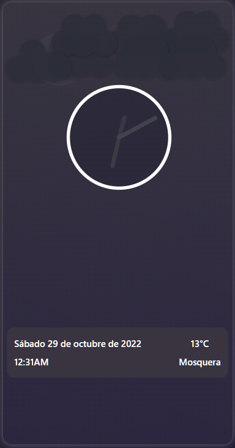

## GarrClock

### try it in the following link

[GarrClock](https://garruxx.github.io/garrClock/)

This is a simple analog and digital clock with the ability to show you in a very visual way the state of your weather.

It is developed using vite typescript, html, sass and many svg vectors.

It is a personal project created for no other purpose than art ♥

This project is OpenSource and is under the MIT license which is located in the root folder of the project.

# Visual examples

    > Here are some examples of what the screen will look like depending on your weather

## Night with clear Sky

